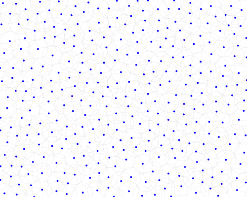

# Poisson Disk Sampling

A fast Poisson Disk sampling algorithm for random 2D points generation.

## Introduction

The Poisson Disk sampling algorithm is used to create random points coordinates, so that each point is separated from all other points by a specified minimum distance. This result in a tighlty-packed and homogeneous set of points.

The implementation is based on [this paper](https://www.cs.ubc.ca/~rbridson/docs/bridson-siggraph07-poissondisk.pdf) by Robert Bridson, and run in *O(n)* time.

## Example

A sample of points generated in the full extent of a Canvas:



Each points is represented by a blue circle, and the minimum distance is visible in gray.

## Usage

```js
var PoissonDisk = require('poisson-disk');

var viewport = [0, 0, 100, 100];
var minDistance = 10;
var Sampling = new PoissonDisk(viewport, minDistance);

// Create a set of random points
var allPoints = Sampling.all();
console.log(allPoints);
// output: [{x: 12, y: 57}, {x: 96, y: 68}, ...]

Sampling.reset();

// Create each point one by one
var eachPoints = new Array(0);
while (true) {
  var point = Sampling.next();
  if (Sampling.done()) {
    break;
  }
  console.log(point);
  // output: {x: 54, y: 35}
  eachPoints.push(point);
}
console.log(eachPoints);
// output: [{x: 54, y: 35}, {x: 46, y: 62}, ...]
```

The Web demonstration in the `example` folder can be opened with [raw.githack](https://raw.githack.com/ogus/poisson-disk/master/example/index.html).


## API

### Constructor

#### `new PoissonDisk(viewport, minimumDistance [, maxTries [, rng]])`

The creator accepts 4 arguments:

 + `viewport`: An array of 4 values that defines the points bounding box (*format: [xMin, yMin, xMax, yMax]*)

 + `minimumDistance`: The minimum distance between each points (*minimum: 1*)

 + `maxTries`: The maximum number of tries to generate a new point (*default: 30*)

 + `rng`: The random number generator, with output in [0, 1) (*default: Math.random*)

### Creation Methods

#### `PoissonDisk.next()`

Returns the `{x, y}` coordinates of a new random point in the viewport.
This point will be distant from all previously generated points by at least `minimumDistance`.

Returns `null` if it is not possible to create a new point that respect the minimum distance condition.

*Note:* The algorithm can not predict in advance if there is enough free space to create a new point. Therefore, make sure to test for `null` value when the methods is used in a loop.

#### `PoissonDisk.all()`

Returns an `Array` with the `{x, y}` coordinates of all random points created.

### Utility Methods

#### `PoissonDisk.reset()`

Reset the internal state of the PoissonDisk sample, by removing all informations on previously generated points.

This internal reset is automatically executed when then `all()` method is called.

#### `PoissonDisk.done()`

Returns a `Boolean` that indicates if the sampling is finished, meaning that all values from the `next()` methods will be null

### Data format

The points are `Object` with the following format: `{x: number, y: number}`.


## Installation

The module can be installed from `npm`

```sh
npm install poisson-disk
```

It can also be installed by cloning the repository & including the `poisson-disk.js` file in your project.

## Installation

You can install the module with [npm](https://www.npmjs.com/)
```sh
npm install poisson-disk
```

You can import the module with a CDN like [unpkg](https://unpkg.com/)
```html
<script type="text/javascript" src="https://unpkg.com/poisson-disk@latest"></script>
```

You can clone the repository & include the `poisson-disk.js` file in your project:
```sh
git clone https://github.com/ogus/poisson-disk.git
```


## License

This project is licensed under the WTFPL - see [LICENSE](LICENSE) for more details
